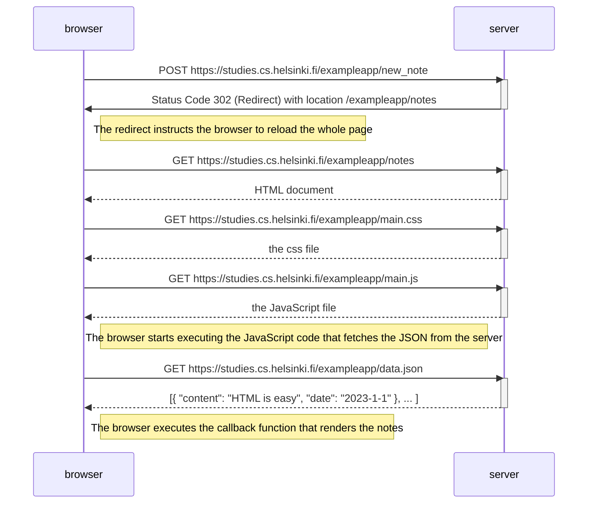
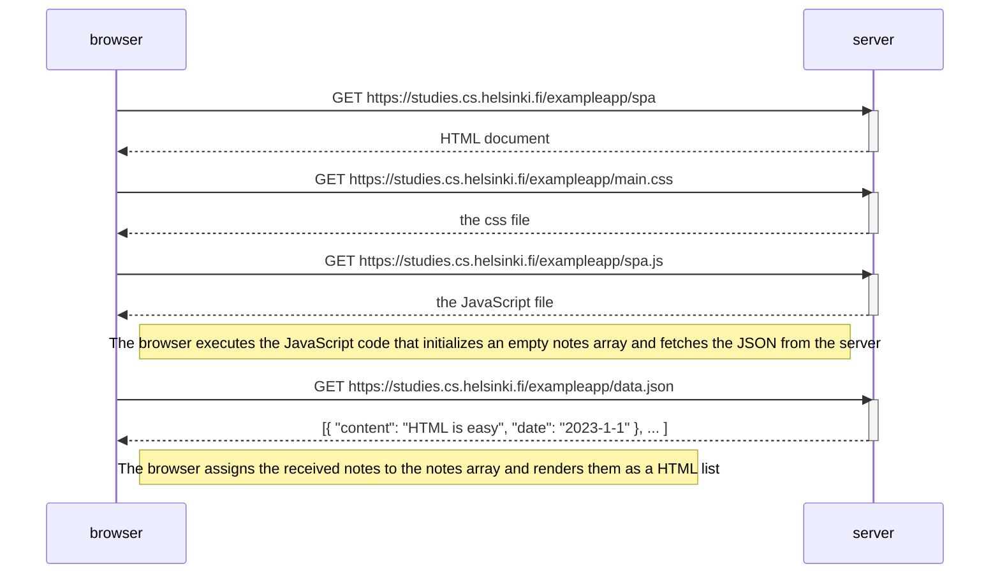
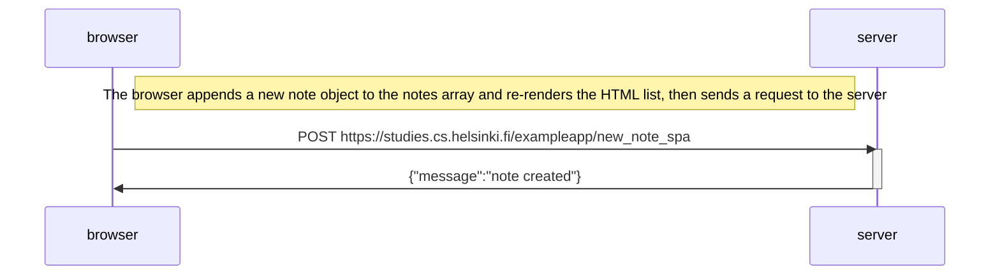

# Exercise 0.4

Creating a new note on the page https://studies.cs.helsinki.fi/exampleapp/notes causes the following sequence of events:

# Exercise 0.5

Visiting the page https://studies.cs.helsinki.fi/exampleapp/spa causes the following sequence of events:

# Exercise 0.6

Creating a new note on the page https://studies.cs.helsinki.fi/exampleapp/spa causes the following sequence of events:

